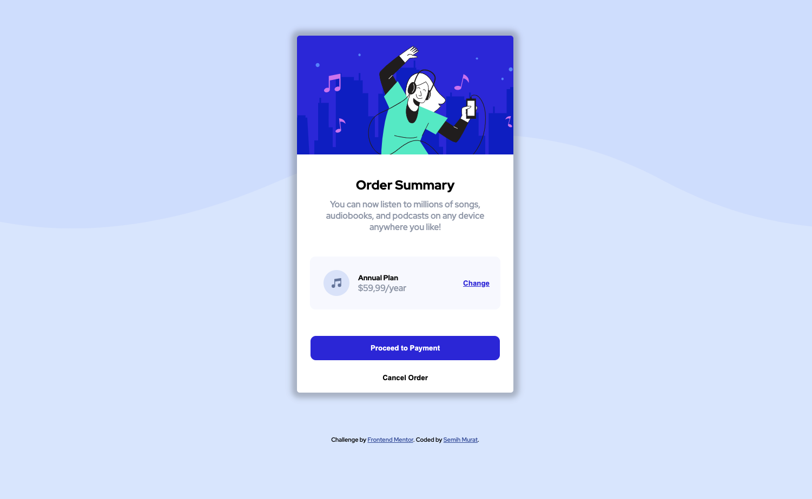

# Frontend Mentor - Order summary card

## Table Of Contents

- [Overview](#Overview)
- [Screenshot](#Screenshot)
- [Links](#Links)
- [Built with](#Built-with)
- [What I Learned](#What-I-learned)
- [Continued Development](#Continued-Development)

### Overview
My first work on Frontend Mentor was very useful for me, especially in terms of using CSS and naming class selectors.

### Screenshot



### Links

- Solution URL: [Github](https://github.com/smhmurat/frontendmentor-order-summary-card)

- Live Site URL: [Vercel](https://frontendmentor-order-summary-card.vercel.app/)

### Built with

- Semantic HTML5 markup
- CSS custom properties
- Flexbox
- CSS Grid
- Mobile-first workflow

### What I learned

In this study, I learned how a card design should be in the center of the screen, especially according to the screen size used. I have experienced how to place sub-elements and use basic HTML and CSS.

Especially in CSS, the display issue was one of the most difficult topics for me.

```css
.card-body-plan {
    position: relative;
    display: flex;
    align-items: center;
    justify-content: flex-start;
    background-color: #f8f9fe;
    margin: 1.5rem;
    border-radius: 10px;
    padding: 25px;
}
```

### Continued Development

Display, grid, flexbox and responsive design topics will be the topics that I have the most difficulty at this stage and that I will focus on in the projects I will do in the future.

### Author

- Frontend Mentor [@smhmurat](https://www.frontendmentor.io/profile/smhmurat)
- Twitter [@smhmurat](https://twitter.com/smhmurat)